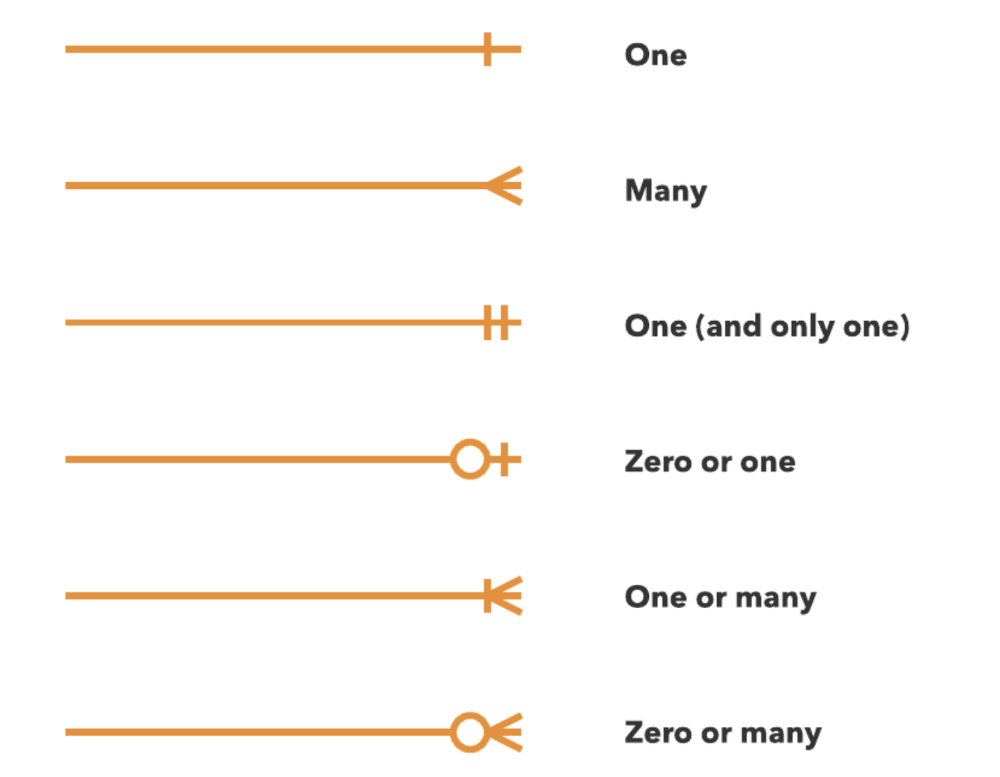

Describe a scenario in one or two paragraphs in short the below ER and answer the following question based on your understanding and your own words and answer below questions:
add more one/ two attributes for any of the entities?
Write the type of relationship between the entities and describe it.

Main connections:

1)  Student enrolls in enrollments, they are connectet with Enrolls entity
2)  Enrollment, Lecturer and Subjects are all connected with a Lectures entity

So basically we have a classical university ER diagram, with students, lecturers, lectures and so on.

For some reason, all connections on diagram are 1 to 1

